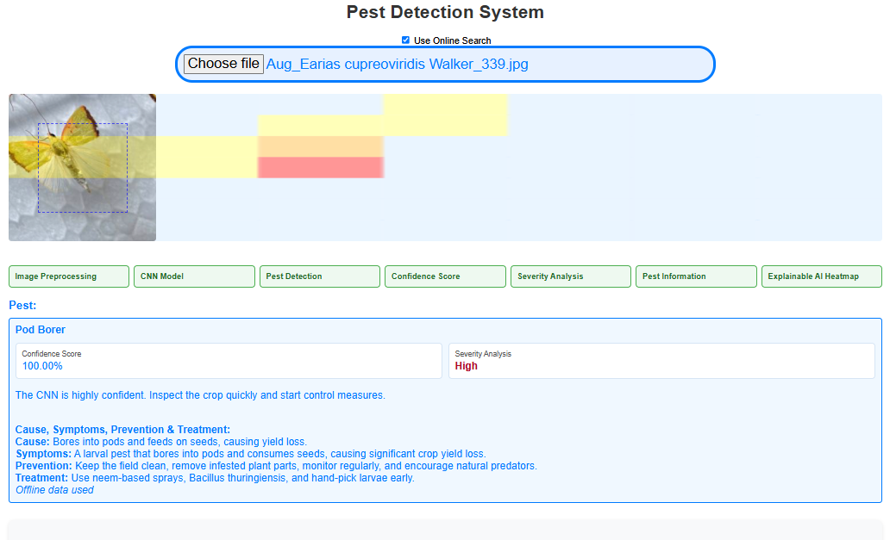

# Pest Detection and Information System

This is a web-based pest detection app for identifying jute crop pests from uploaded images. It uses a custom Teachable Machine image model running with TensorFlow.js in the browser, then displays the detected pest, confidence score, severity analysis, pest information, and an explainable AI heatmap.

The app supports both online and offline information lookup. When online search is enabled and the Google Custom Search API responds successfully, it displays web-based pest information. If online search is unavailable or fails, it falls back to the local `pestData.json` file.

## Features

- Upload and preview a pest image.
- Preprocess the image to the model input size before prediction.
- Classify pests using a trained CNN image model exported from Teachable Machine.
- Display the top pest prediction and confidence score.
- Reject unclear images when the confidence is too low or the prediction margin is weak.
- Show severity analysis as Low, Medium, or High.
- Provide pest information including cause, symptoms, prevention, and treatment.
- Work offline using local pest data.
- Optionally use Google Custom Search for online pest information.
- Display an explainable AI heatmap showing image regions that influenced the prediction.
- Show a simple bounding-box style visual guide over the uploaded image.

## App Workflow

1. **Image Preprocessing**
   The uploaded image is resized and centered to match the CNN input size.

2. **CNN Model**
   The Teachable Machine image model runs locally in the browser through TensorFlow.js.

3. **Pest Detection**
   The model predicts the most likely pest class.

4. **Confidence Score**
   The app displays the prediction confidence and checks whether the result is reliable.

5. **Severity Analysis**
   The app assigns a severity level based on prediction confidence:
   - High: 92% and above
   - Medium: 84% to 91.99%
   - Low: below 84%

6. **Pest Information**
   The app displays cause, symptoms, prevention, and treatment information from either online search or local offline data.

7. **Explainable AI Heatmap**
   The app uses occlusion sensitivity to generate a heatmap. It hides small parts of the image, runs the model again, and highlights areas that most affect the model's confidence.

## Technologies Used

- HTML5
- CSS3
- Vanilla JavaScript
- TensorFlow.js
- Teachable Machine image model
- Google Custom Search API
- Local JSON data for offline pest information

## Project Structure

```text
.
├── index.html
├── style.css
├── script.js
├── pestData.json
├── js/
│   ├── tf.min.js
│   └── teachablemachine-image.min.js
├── my_model/
│   ├── model.json
│   ├── metadata.json
│   └── weights.bin
└── screenshots/
```

## Screenshots

| Screenshot | Description |
|---|---|
|  | Prediction result with confidence, severity, pest information, and heatmap |
|  | App interface |
|  | Detection workflow output |
|  | Additional result view |

## Setup Guide

1. Clone or download the project.
2. Make sure the exported Teachable Machine model files are inside `my_model/`.
3. Make sure the local TensorFlow.js files are inside `js/`.
4. Update the Google API values in `script.js` if you want online search:

```js
const apiKey = "YOUR_GOOGLE_API_KEY";
const cx = "YOUR_CUSTOM_SEARCH_ENGINE_ID";
```

5. Run the project from a local server. This is recommended because the app loads local JSON and model files.

Example using Node:

```bash
npx serve .
```

Then open the localhost URL shown in the terminal.

## Offline and Online Modes

The **Use Online Search** checkbox controls whether the app tries Google Custom Search first.

If online search is disabled, the internet is unavailable, the API key is invalid, the search quota is exhausted, or Google returns no result, the app uses `pestData.json` and shows **Offline data used**.

## Explainable AI Heatmap

The heatmap is not a separate model. It is an explanation layer added on top of the CNN prediction. Red and orange areas show regions that had stronger influence on the model's prediction. Lighter or blue areas had less influence.

This helps demonstrate that the system is not only predicting a pest label, but also giving a visual explanation of what part of the image affected the decision.

## Project Status

The app currently includes the full pest detection workflow requested for the project:

- Image preprocessing
- CNN-based pest detection
- Confidence score
- Severity analysis
- Pest information
- Cause, symptoms, prevention, and treatment
- Explainable AI heatmap
- Offline and online information support

Future improvements could include a more advanced Grad-CAM heatmap, real object detection bounding boxes, more pest classes, and a larger validated dataset.

## Acknowledgments

- Google Teachable Machine
- TensorFlow.js
- Google Programmable Search Engine
- Jute pest image dataset used for model training

## Contact

For collaboration or suggestions, contact the developer.

- Email: ibahimamanatullahi@gmail.com
- WhatsApp: +2348145826770
